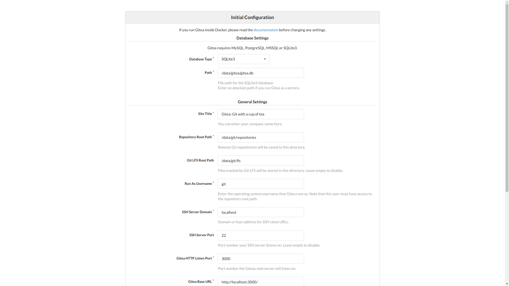

# Setup

The first time you access the Gitea web interface, the home page will appear. 
Clicking on "Register" or "Sign In" in the upper right corner will take you to 
the setup page. On the setup page, you can configure the following settings:

- Database Settings: database type and other database-dependent settings. You can
  choose from SQLite3, MySQL, PostgreSQL, and Microsoft SQL Server. (Default: 
  SQLite3.)
- General Settings:
  - Site Title (default: "Gitea: Git with a cup of tea")
  - Repository Root Path (default: `/data/git/repositories`)
  - Git LFS Root Path (optional, default: `/data/git/lfs`)
  - Run As Username (default: `git`)
  - SSH Server Domain (default: `localhost`)
  - SSH Server Port (optional, default: 22)
  - Gitea HTTP Listen Port (default: 3000)
  - Gitea Base URL (default: http://localhost:3000/)
  - Log Path (default: `/data/gitea/log`)
- Optional Settings:
  - Email Settings
  - Server and Third-Party Service Settings
  - Administrator Account Settings: You may create an administrator account here.
    If you do not, the first account created after setting up Gitea will 
    be an admin account.

<!-- TODO Describe setup options -->
<!-- TODO Add screenshots -->

When you are done configuring Gitea, click the button labeled "Install Gitea" at
the bottom of the page.

After finishing the setup process, you will be directed to a page where you can 
create a user account. The first registered user will automatically become an 
administrator.
